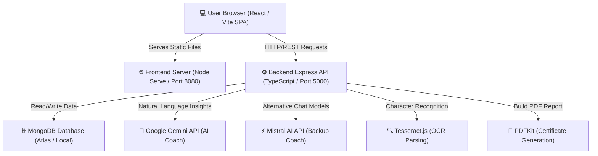

# 🌿 EcoWise AI — Carbon Footprint & Sustainability Platform

EcoWise AI is a world-class, personal carbon footprint calculator, sustainability advisor, and green mapping assistant. Powered by artificial intelligence, it provides users with personalized insights, game-like incentives, and community-driven actions to track, reduce, and offset their ecological impact.

---

## 🏗️ System Architecture

The project is structured as a monorepo consisting of a decoupled **React/Vite Frontend** and an **Express/TypeScript Backend** communicating via a REST API.



---

## ✨ Core Features

### 1. 📊 Interactive Dashboard
An overview of the user's carbon metrics, points balance, current game level, and a feed of recent activities.

### 2. ⚡ AI Utility Bill & Receipt OCR Scanner
Allows users to upload energy bills or grocery receipts. The system extracts consumption metrics using [Tesseract.js](file:///e:/Carbon/backend/src/controllers/ocrController.ts) OCR and returns carbon estimations along with eco-friendly alternatives.

### 🚲 3. Green Route Planner & Eco Map
Enables users to calculate and compare carbon emissions for walking, cycling, public transit, and driving between destinations. It also highlights nearby local eco-facilities (EV charging, recycling centers, organic markets).

### 🤖 4. AI Habit Coach (EcoBot)
An interactive AI assistant supporting multiple languages (English, Spanish, Hindi, etc.) and models (Gemini Flash & Mistral). EcoBot evaluates telemetry data and creates custom sustainability schedules.

### 🏆 5. Goals & Challenges
* **Individual Targets**: Setup personal limit reduction parameters (e.g. reduce driving) and forecast progress.
* **Community Challenges**: Enroll in events (e.g., Meat-Free Week) and scan location QR codes to check in.
* **Competitive Rankings**: Compete inside family or corporate groups with real-time leaderboards.

### 🛒 6. Eco Offset Marketplace
Browse and fund verified carbon offset projects (like Amazon reforestation or wind farms) using points or mock purchases. A certified transaction ledger lets users download PDF certificates generated dynamically.

---

## 🛠️ Codebase Structure

* **[frontend](file:///e:/Carbon/frontend)**: A React SPA built with Vite, TypeScript, TailwindCSS, Zustand (State Management), and Lucide React.
  * **[frontend/src/config.ts](file:///e:/Carbon/frontend/src/config.ts)**: Configures and normalizes dynamic backend routing.
  * **[frontend/index.html](file:///e:/Carbon/frontend/index.html)**: Main HTML template with SEO-optimized metadata.
* **[backend](file:///e:/Carbon/backend)**: An Express REST API server utilizing TypeScript, Mongoose, Helmet (OWASP protection), and Rate Limiting.
  * **[backend/src/app.ts](file:///e:/Carbon/backend/src/app.ts)**: Core server configuration, middleware, and CORS security.
  * **[backend/src/routes/api.ts](file:///e:/Carbon/backend/src/routes/api.ts)**: API sub-router mapping authentication, OCR, and AI routes.
  * **[backend/src/seed.ts](file:///e:/Carbon/backend/src/seed.ts)**: Database seed helper to load demo data.

---

## 🚀 Local Development Setup

### Prerequisites
* [Node.js](https://nodejs.org) (v20+ recommended)
* [MongoDB](https://www.mongodb.com) (Running locally or a cloud database)

### Installation
1. Clone the repository and navigate to the project root:
   ```bash
   cd Carbon
   ```
2. Install all dependencies for both frontend and backend:
   ```bash
   npm run install:all
   ```
3. Copy the backend environment variables configuration and customize your keys:
   ```bash
   cp backend/.env.example backend/.env
   ```
4. Seed the database with default users and catalogs:
   ```bash
   npm run seed --prefix backend
   ```
5. Spin up both development servers concurrently:
   ```bash
   npm run dev
   ```
   * Frontend: `http://localhost:5173`
   * Backend: `http://localhost:5000`

---

## 🐳 Docker & Production Deployments

The application is containerized and ready for cloud deployment. You can run the entire environment locally using Docker Compose:

```bash
docker-compose up --build
```

### ☁️ Deploying Backend on Render (Docker)
1. Set up a new **Web Service** pointing to the `Ecowise` repository.
2. Configure settings:
   * **Root Directory**: `backend`
   * **Runtime**: `Docker`
   * **Dockerfile Path**: `Dockerfile`
3. Add environment variables:
   * `MONGODB_URI` (Your MongoDB Atlas URL)
   * `JWT_SECRET` (A strong random secret)
   * `GEMINI_API_KEY` (Google Gemini Key)

### ☁️ Deploying Frontend on Cloud Run
1. Deploy the frontend container using the [frontend/Dockerfile](file:///e:/Carbon/frontend/Dockerfile).
2. Configure the `VITE_API_URL` environment variable:
   * **VITE_API_URL**: `https://<your-backend-render-url>/api`

The frontend build will automatically compile, serve static assets via a clean web server, and dynamically route Axios calls to your Render backend database endpoints.
